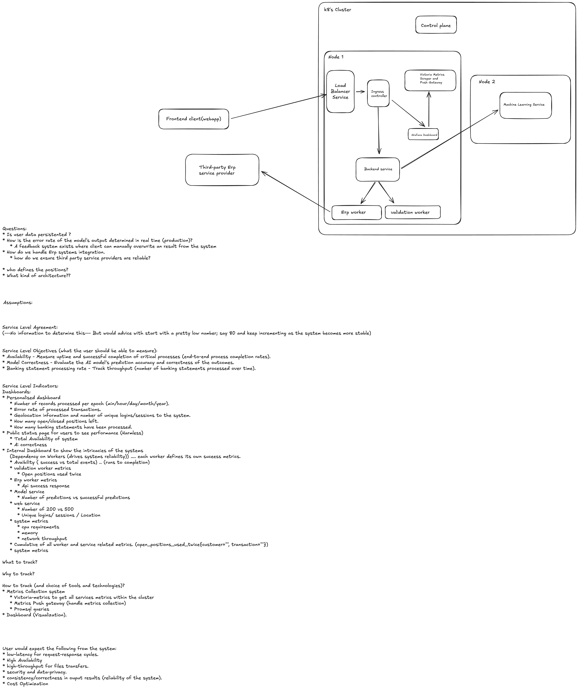

## Problem Statement and Solution Approach

### Problem Statement

1. **Ingesting Banking Statements**: Customers upload banking statements to a cloud environment.
2. **Matching Against Open Positions**: The system matches statements with open positions using transaction amounts and descriptions.
3. **Ensuring Data Integrity**: Ensuring no open position is used more than once and highlighting unmatched positions for manual intervention.
4. **ERP System Integration**: Once the matches are finalized and approved, data is pushed into the customer’s ERP system to close open positions.

### Key Challenges

1. **System Stability and Availability**:
   Ensuring the services running on Kubernetes operate reliably, scale efficiently, and meet uptime guarantees.
2. **Process Performance and Accuracy**:
   Monitoring the throughput of banking statement processing while evaluating the accuracy of the AI model and ensuring data correctness.
3. **Error Detection and Diagnostics**:
   Identifying errors in transaction matching or integration with the ERP system and providing actionable insights to the engineering team.
4. **Customer Value Demonstration**:
   Delivering clear metrics on how the solution reduces manual effort, improves accuracy, and accelerates processes for the customer.
5. **Operational Visibility**:
   Providing a comprehensive view of system performance to internal teams (engineering, SRE) and external stakeholders (customers, management).

## Solution Approach

### Objective

To design and implement a robust monitoring system that:
- Tracks system performance, stability, and accuracy.
- Surfaces metrics in a way that is meaningful to customers, internal teams, and external stakeholders.
- Enables quick detection and resolution of issues.

### Proposed Solution

#### 1. Metrics Identification

Metrics are categorized into three primary groups:
1. **Customer-Facing Metrics (Personalized Dashboard)**:
   - Number of banking statements processed (per epoch).
   - Error rate of transactions.
   - Open/closed positions.
   - AI model correctness rate.
2. **Internal Metrics (SRE Dashboard)**:
   - Worker success vs failure rates.
   - Resource utilization (CPU, memory, network).
   - Open positions reused or unmatched.
   - ERP API success rates.
   - End-to-end process latency.
3. **Public Metrics (Status Page)**:
   - System availability.
   - Aggregate AI model correctness.

#### 2. System Design

The solution consists of three key components:
1. **Instrumentation**:
   - Use the Victoria-Metrics Python client to expose key metrics from backend services.
   - Add metrics collection points for each critical step in the pipeline (ingestion, matching, validation, ERP integration).
2. **Metrics Aggregation**:
   - Deploy Victoria-Metrics to scrape metrics from workers and Kubernetes system metrics (via kube-state-metrics and cAdvisor).
   - Use a Victoria-Metrics Pushgateway to collect and push aggregated metrics when direct scraping isn’t feasible.
3. **Visualization**:
   - Deploy Grafana to build interactive dashboards tailored for internal teams and customers.
   - Create different views for customer-facing, internal, and public metrics.

#### 3. Monitoring Workflow

1. **Data Collection**:
   - Workers expose metrics via `/metrics` endpoints.
   - Victoria-Metrics scrapes metrics periodically and aggregates them in a time-series database.
2. **Data Visualization**:
   - Grafana queries Victoria-Metrics for data using PromQL and displays the metrics as:
     - Time-series graphs (e.g., throughput over time).
     - Gauges (e.g., correctness rate).
     - Tables (e.g., unmatched open positions).

#### 4. Implementation Plan for Poc

1. **Metrics Definition**:
   Identify key metrics and instrument Python workers to expose them:
   - Statements processed, error rates, open positions, etc.
2. **Infrastructure Setup**:
   - Deploy Victoria-Metrics and Grafana with Docker.
   - Configure Victoria-Metrics to scrape metrics from workers and Kubernetes.
3. **Dashboard Creation**:
   - Build personalized dashboards for customers showing automation and ROI.
   - Develop internal dashboards for SRE teams focusing on system health and bottlenecks.
4. **Testing and Validation**:
   - Simulate worker traffic and validate the collection and visualization of metrics.

#### 5. Technologies Used in The Poc

- Victoria-Metrics: Metrics scraping, aggregation, and alerting.
- Grafana: Interactive visualization and dashboards.
- Docker: Deploying all services.
- Victoria-Metrics Python Client: Exposing custom metrics in Python.

### Expected Benefits

1. **Improved System Stability**:
   - Proactive detection of errors and performance bottlenecks.
2. **Operational Insights**:
   - Detailed dashboards for SRE teams to monitor and optimize system health.
3. **Customer Trust**:
   - Clear demonstration of system reliability and ROI through customer-facing dashboards.
4. **Enhanced Debugging**:
   - Granular metrics allow quicker identification of problem areas.
5. **Scalability**:
   - Metrics-driven scaling ensures the system handles increasing loads efficiently.

## Conclusion

This solution addresses the challenges of monitoring by creating a centralized system for collecting, aggregating, and visualizing key metrics. This approach is scalable and can be extended to incorporate additional metrics and services as Nooxit grows.